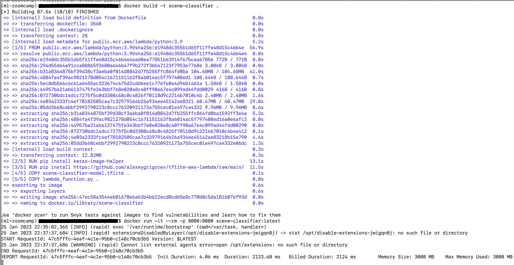
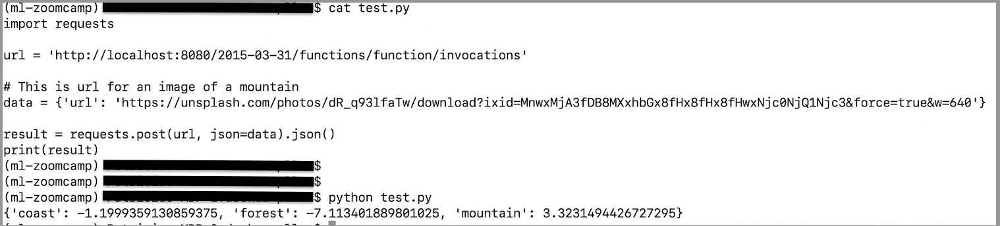

## Building and Testing (Locally) Docker Image

##### The files we need:  

- [Dockerfile](Dockerfile)  

- TF-Lite version of the model: scene-classifier-model.tflite 

- AWS Lambda Function: [lambda_function.py](lambda_function.py)

- test function for testing the container locally: [test.py](test.py)

- optional: some image URLs are available in [sample\_image\_urls.txt](sample_image_urls.txt) for use in testing with [test.py](test.py)

#### Python libraries needed for running test.py: 

- TF-Lite Runtime

    ```bash
    $pip install --extra-index-url https://google-coral.github.io/py-repo/ tflite_runtime
    ```
- Keras Image Helper

    ```bash
    pip install keras-image-helper
    ```

### Building, running and locally-testing the container

1. The following screenshot shows the commands 'docker build' and 'docker run'.  We build a Docker image named 'scene-classifier'.

    ```bash
    docker build -t scene-classifier .
    ```
    ```bash
    docker run -it --rm -p 8080:8080 scene-classifier:latest
    ```

    

2. Open another terminal to run test.py.  To test a different image, edit the 'url' field in test.py.

    ```bash
    python test.py
    ```
    


