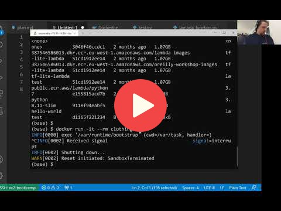
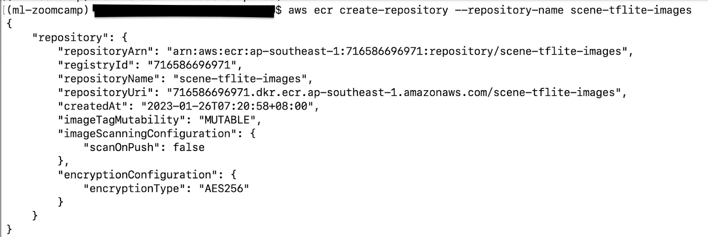
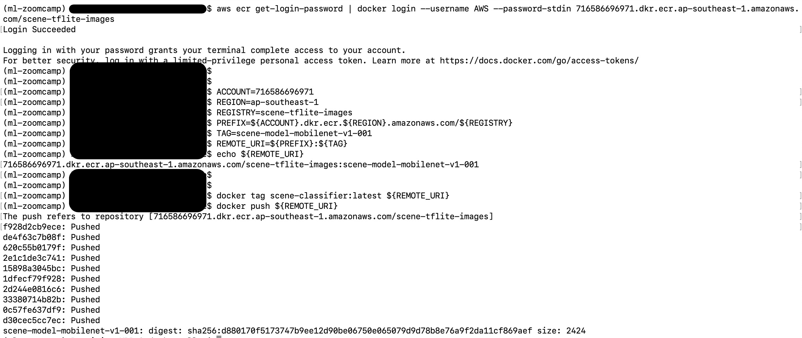
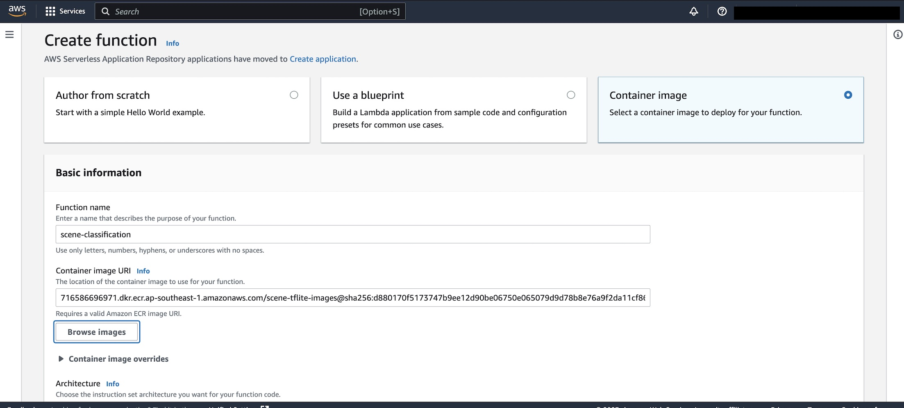
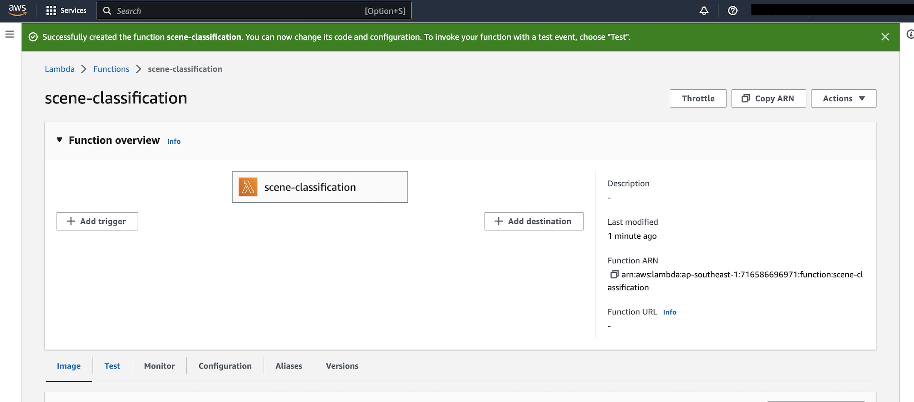
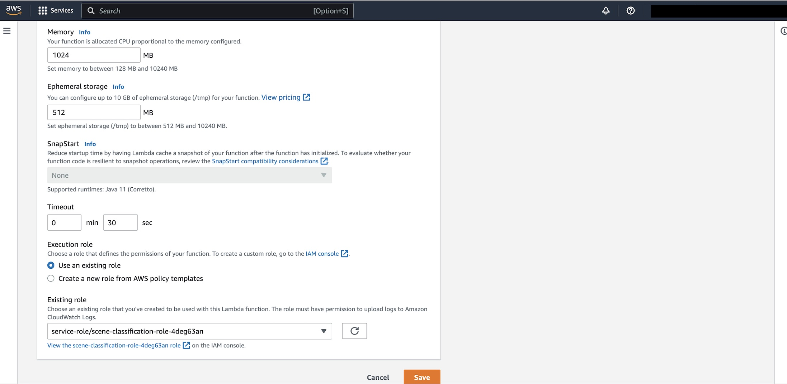
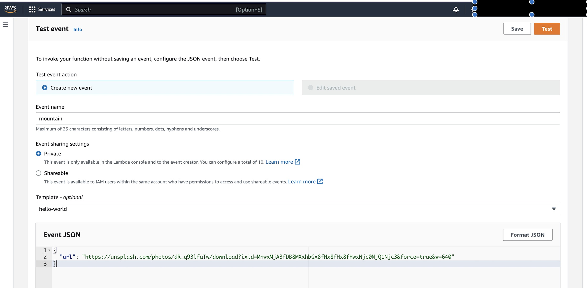
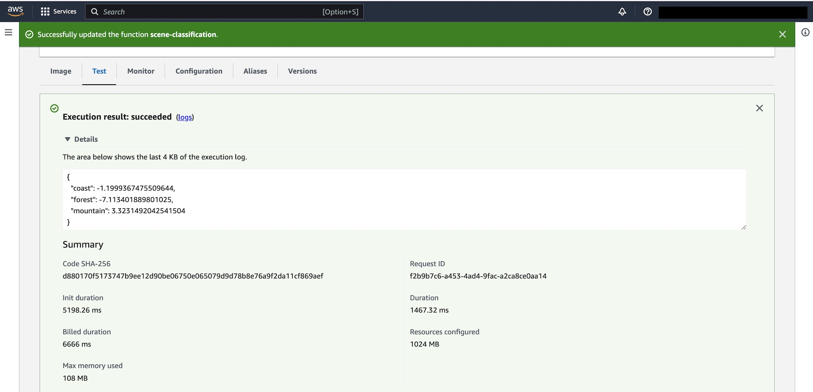

## Deploying to AWS Lambda

After building the Docker image, we publish it to an AWS ECR (Elastic Container Registry) repository and test the classifier in AWS.  Details of building and testing the Docker image are described in [containerize.md](containerize.md).

For detailed instructions and explanations of how to set up the repository and testing the lambda function, please refer to the course video ML Zoomcamp 9.6 - Creating the Lambda Function:

<a href="https://www.youtube.com/watch?v=kBch5oD5BkY&list=PL3MmuxUbc_hIhxl5Ji8t4O6lPAOpHaCLR"></a>


However, please note that there is an update to the AWS CLI command for logging into the ECR repository, which we will describe below.


##### The files/resources we need:  

- Docker image: scene-classifier
- AWS CLI library

To install AWS CLI:  

```bash
pip install awscli
```


### Procedure

1. We use AWS command-line utility to create an ECR repository to which we publish our Docker image. We name the repository 'scene-tflite-images'  

    ```bash
    $aws ecr create-repository --repository-name scene-tflite-images
    ```

    


2. To log into the repository, we need the repository URI which was returned by AWS when we created the repo in the previous step.

    ```bash
    $ aws ecr get-login-password | docker login --username AWS --password-stdin [repositoryUri]
    ```

3. Tag the image:

    ```bash
    $ docker tag scene-classifier:latest ${REMOTE_URI}
    ```

4. Push the image to ECR:

    ```bash
    $ docker push ${REMOTE_URI}
    ```

    The following screenshot shows steps 2-4 in greater detail:

    


5.  On the AWS Console, find AWS Lambda services and create a Lambda Function.  Select "Container image".  Fill in "Function name" and look up the "Container image URI" by clicking the "Browse images" button and selecting the published image.

    
    
    This screenshot shows the created lambda function:
    
    
    
   
6.  Click on the "Test" tab of the Lambda Function to configure a test.  Set "Memory" to 1024 MB and "Timeout" to 30 seconds.  Save the settings.

    
    
    
7.  Create a Test Event and specify the url of the test image in the "Event JSON" section.  Click the Test button to run the prediction.

    
    
    The results of the test show that the model predicts the image is of a mountain.
    
      
    
    


